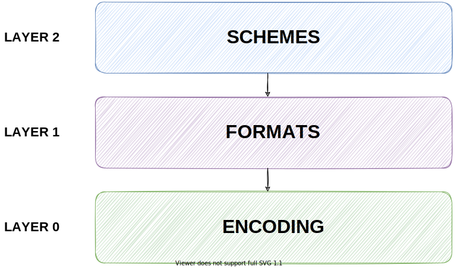

# Threshold Crypto Library Design
  
This documentation is split into three layers. On layer 2, the top layer, are the concrete schemes described. On layer 1, the format layer, there are different ways to represent outputs and inputs of the schemes on layer 2 and layer 0 specifies how those inputs/outputs are serialized as bytes.
## **Overview**
- [Interface](https://gitlab.inf.unibe.ch/crypto/2021.cosmoscrypto/-/blob/master/design/interface.md)
- [Definition of a Party](https://gitlab.inf.unibe.ch/crypto/2021.cosmoscrypto/-/blob/master/design/party.md)
- [Schemes](https://gitlab.inf.unibe.ch/crypto/2021.cosmoscrypto/-/blob/master/design/schemes/)
    - [DL Schemes](https://gitlab.inf.unibe.ch/crypto/2021.cosmoscrypto/-/blob/master/design/schemes/dl_schemes.md)
- [Formats](https://gitlab.inf.unibe.ch/crypto/2021.cosmoscrypto/-/blob/master/design/formats/)
    - [PKCS #1](https://gitlab.inf.unibe.ch/crypto/2021.cosmoscrypto/-/blob/master/design/formats/pkcs1.md)
    - [PKCS #8](https://gitlab.inf.unibe.ch/crypto/2021.cosmoscrypto/-/blob/master/design/formats/pkcs8.md)
- [Encoding](https://gitlab.inf.unibe.ch/crypto/2021.cosmoscrypto/-/blob/master/design/encoding/)
    - [ASN.1](https://gitlab.inf.unibe.ch/crypto/2021.cosmoscrypto/-/blob/master/design/encoding/asn1.md)
    - [IEEE 1363](https://gitlab.inf.unibe.ch/crypto/2021.cosmoscrypto/-/blob/master/design/encoding/ieee1363.md)
