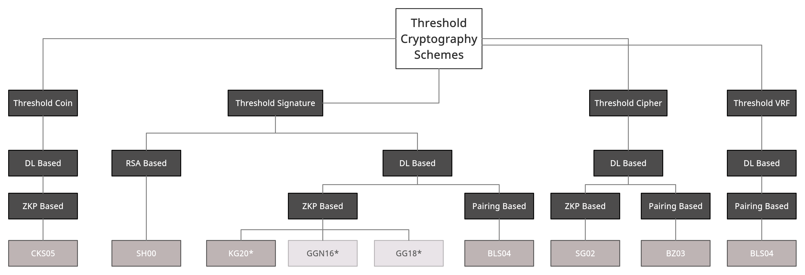

# Threshold Schemes

*: (Semi-)interactive schemes
[KG20](https://eprint.iacr.org/2020/852.pdf), [GGN16](https://link.springer.com/content/pdf/10.1007%2F978-3-319-39555-5_9.pdf), [GG18](https://eprint.iacr.org/2019/114.pdf)

*Image generated using creately.com (https://app.creately.com/diagram/K5aZab4jKKj/edit)*
