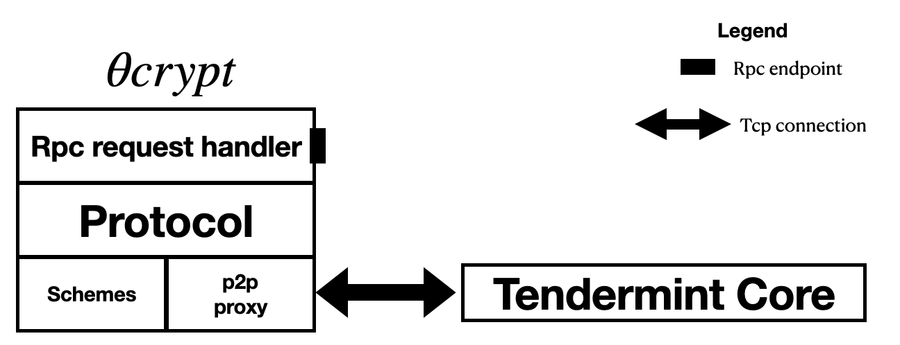

# Threshold Cryptography Library in Rust

This is a WIP library for threshold cryptography implementing various threshold cipher, signatures and coin schemes. Thetacrypt relies on Tendermint Core for atomic broadcast and runs as a service next to Tendermint on a node. It exposes an RPC server where users can submit threshold cryptography requests.

Thetacrypt is divided into three main layers: 
- Network Layer - handles transport of messages and atomic broadcast
- Protocol Layer - defines how the nodes communicate while executing a scheme
- Schemes Layer - implements the primitives of the actual threshold schemes

A client can use the primitives of the schemes layer directly without having to run Thetacrypt as a service. 
A simple example would look as follows: We are starting with a Tendermint network consisting of 5 nodes which all run Thetacrypt alongside Tendermint. A client (which imports the schemes layer of Thetacrypt as a library) sends an RPC request to Thetacrypt on one of the nodes requesting a public key used for encryption. Upon receiving the desired public key, it then encrypts the message using the key. To decrypt the message, the client sends an RPC request to one of the nodes containing the ciphertext. The nodes now participate in a threshold decryption protocol and jointly decrypt the ciphertext.

Alternatively, a client could request a signature public key using an RPC call to Thetacrypt and submit a message to be signed by the network via another RPC request. The nodes then jointly compute a threshold signature on the requested message, which can be verified using the single public key.
