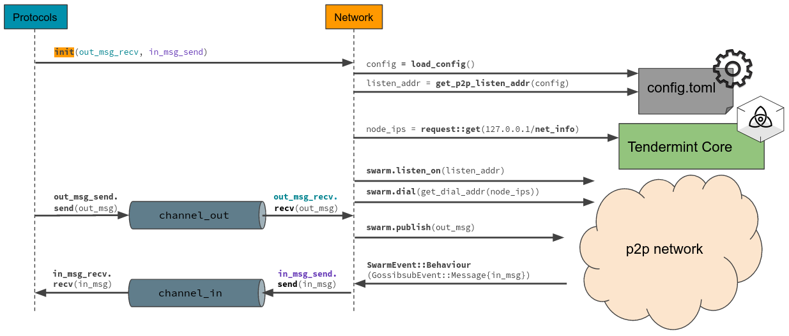
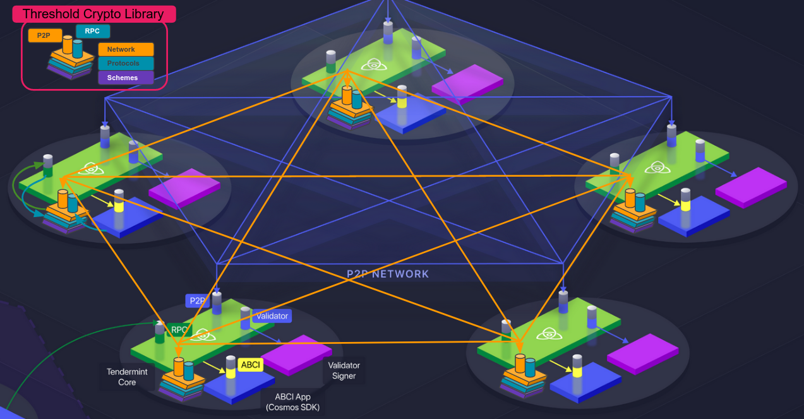

# The network layer

Two interfaces are provided: one for a *static* network and one for a network that uses *Tendermint* in order to get the IP addresses of the other peers.

# Interface for a *static* network

- *static* means that all the IPs and port numbers are given in `config.toml`, e.g.  
`ids = [1, 2, 3, 4]` 
`ips = ["127.0.0.1", "127.0.0.1", "127.0.0.1", "127.0.0.1"]` 
`p2p_ports = [27001, 27002, 27003, 27004]` 
`rpc_ports = [50051, 50052, 50053, 50054]` 

- The `init(...)` function for a *static* network requires two channel endpoints, one for receiving messages from the Protocols layer to broadcast to the P2P network and one to send the incoming messages to the Protocols layer. Additionally, the server's id is required in order to load the correct IPs and port numbers from `config.toml`.

- When running a server in a *static* network provide the `-l` flag, e.g.  
`cargo run --bin server 1 -l` 

- The script `run_static_net_example.sh` in `src/protocols` can be executed in order to open four terminals and starting a server in each of them automatically.

# Interface for a *Tendermint* network

- Instead of keeping track of all the server IPs in a `config.toml` file we only list the port numbers for our P2P and RPC network, e.g.  
`p2p_port = 27000`  
`rpc_port = 50050`  
and ask the local Tendermint RPC endpoint for the IPs of the other Tendermint nodes.

- The `init(...)` function for a network that runs with *Tendermint* only requires two channel endpoints, the one for receiving messages from the Protocols layer to broadcast to the P2P network and one to send the incoming messages to the Protocols layer.

- This setup assumes that our Threshold Crypto Library instances are running on the same full node (hence, are accessible through the same IP) as the Tendermint Core instances. The figure below illustrates a network of five full nodes where Tendermint Core and the Threshold Crypto Library instances are running together on every node.

# About **libp2p**
We are using the Rust implementation of **libp2p** (https://github.com/libp2p/rust-libp2p), which is a modular peer-to-peer networking framework.

Learn more: https://docs.rs/libp2p/latest/libp2p/

# About **Floodsub** and **Gossipsub**
https://docs.libp2p.io/introduction/what-is-libp2p/: Sending messages to other peers is at the heart of most peer-to-peer systems, and pubsub (short for publish / subscribe) is a very useful pattern for sending a message to groups of interested receivers. 
**libp2p** defines a pubsub interface for sending messages to all peers subscribed to a given “topic”. The interface currently has two stable implementations:
- **Floodsub** uses a very simple but inefficient “network flooding” strategy, and
- **Gossipsub** defines an extensible gossip protocol.

Learn more:
- https://docs.libp2p.io/concepts/publish-subscribe/
- https://github.com/libp2p/specs/tree/master/pubsub
- https://github.com/libp2p/specs/tree/master/pubsub/gossipsub#implementation-status

This **Network layer** contains implementations of both libp2p protocols, but the currently provided interfaces (`init(...)`) implement the **Gossipsub** protocol for the P2P networking.

# About **Tokio** and **async_std**

Both are asynchronous runtimes for Rust that don't seem to differ much from each other. Since **Tokio** has a larger ecosystem than **async_std** we decided to use **Tokio** as asynchronous runtime.

Tokio:
- https://tokio.rs/
- https://tokio.rs/tokio/tutorial

async_std:
- https://crates.io/crates/async_std
- https://book.async.rs/