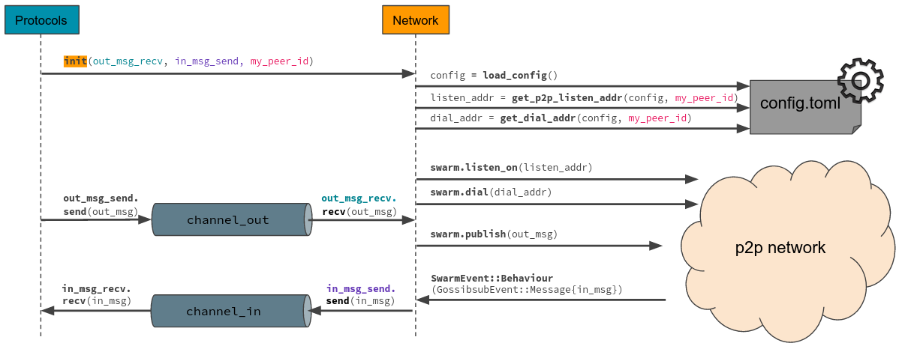

# The network layer

The network layer implements a p2p network, plus additional proxy modules that implementing the same interface relay on a remote service for communication.

## Interface for a *static* network

- *static* means that all the IPs and port numbers are given by a configuration file "server<replica_id>".

- The `init(...)` function for a *static* network requires two channel endpoints, one for receiving messages from the Core layer and to broadcast them to the P2P network, and one to send the incoming messages from the p2p network to the Core layer.

- The script `run_static_net_example.sh` in `src/protocols` can be executed in order to open four terminals and starting a server in each of them automatically.

## About **libp2p**

We are using the Rust implementation of **libp2p** (https://github.com/libp2p/rust-libp2p), which is a modular peer-to-peer networking framework.

Learn more: https://docs.rs/libp2p/latest/libp2p/

## About **Floodsub** and **Gossipsub**

https://docs.libp2p.io/introduction/what-is-libp2p/: Sending messages to other peers is at the heart of most peer-to-peer systems, and pubsub (short for publish / subscribe) is a very useful pattern for sending a message to groups of interested receivers. 
**libp2p** defines a pubsub interface for sending messages to all peers subscribed to a given “topic”. The interface currently has two stable implementations:

- **Floodsub** uses a very simple but inefficient “network flooding” strategy, and
- **Gossipsub** defines an extensible gossip protocol.

Learn more:

- https://docs.libp2p.io/concepts/publish-subscribe/
- https://github.com/libp2p/specs/tree/master/pubsub
- https://github.com/libp2p/specs/tree/master/pubsub/gossipsub#implementation-status

This **Network layer** contains implementations of both libp2p protocols, but the currently provided interfaces (`init(...)`) implement the **Gossipsub** protocol for the P2P networking.

## Package structure

### **bin**:
Sandbox - code to test the modules (config, p2p) and examples (see "How to use").

### **config**:
Contains two sub-modules, one for a *static* network (`config/static_net`) and one for a network that runs with *tendermint* (`config/tendermint_net`). Each submodule contains a `config.toml`, a `config_service.rs` that provides functions to load and read the data from `config.toml` and a `deserialize.rs` containing the necessary structs to deserialize the contents of `config.toml`.   The `config.toml` in `config/static_net` contains all IPs and port numbers from each server. The `config.toml` in `config/tendermint_net` on the other hand only contains the port numbers for the P2P and RPC endpoints. The IPs of the other servers are learned via RPC request `/net_info` at the local Tendermint instance, which is located in `config/tendermint_net/rpc_requests`.

### **p2p**:
This module contains two sub-modules, one for each implementation of the libp2p pubsub protocols:

- `gossipsub_setup`

    The sub-module `p2p/gossipsub_setup` contains the two interfaces for the Protocols layer, one for a *static* network (`static_net.rs`) and one for a network that runs with *Tendermint* (`tendermint_net.rs`). The interfaces differ in the way how the IPs and port numbers are retrieved for opening a listening port and for dialing the other servers. Hence, while the interface in `tendermint_net.rs` only requires the receiver of the **out-channel** (`out_msg_recv`) and the sender of the **in-channel** (`in_msg_send`) as input parameter, the interface in `static_net.rs` additionally requires the server's `id`.

    - `static_net.rs`
    With the given server's `id` the local port number can be retrieved from `config.toml` in order to open the P2P listener. Furthermore, using the server's `id` the port numbers of the other servers can be loaded from `config.toml` to establish the P2P network.

    - `tendermint_net.rs`
    In order to dial to the other servers their IPs are requested at the local Tendermint RPC endpoint.

    - `net_utils.rs`
    All common functionalities of `static_net.rs` and `tendermint_net.rs` are located here.

- `floodsub_setup`
    
    The public function `init(...)` in `setup.rs` can be used to send and receive messages to and from the network using the `Floodsub` protocol, the `Mdns` protocol (to automatically identify other peers in the *local* network) and the `tokio` runtime. The customized network-behaviour is defined in `floodsub_mdns_behaviour.rs`.

    The `init` function in `floodsub_tokio_setup.rs` requires the arguments `floodsub::topic` and the `UnboundedReceiver` from the **out-channel**, creates a tokio-based TCP transport, builds a swarm using a random peerId, opens a random listening port and kicks off the select-loop. There are two branches in the select-loop, one for broadcasting messages to the network populated by the `UnboundedReceiver` of the channel and one branch that handles SwarmEvents. Since there is a customized `NetworkBehaviour` defined (`p2p/floodsub/floodsub_mdns_behaviour.rs`), the handling of incoming messages is implemented in the sub-module **deliver**. Note that the function `handle_msg(&self)` is called in `p2p/floodsub/floodsub_mdns_behaviour.rs`. 

### **types**:
Contains the struct `NetMessage` along with two implementations to convert a `NetMessage` into a `Vec<u8>` and vice versa.
See `Types` below for more information.

### **lib.rs**:
Makes all modules accessible from outside and contains a single utility method to get the rust data type.

# Types

### `NetMessage`:

It is the abstraction of a message used in the network crate. It contains
three fields, which are all the network needs to know about a message:
- `instance_id`: The ID of the protocol instance the message is related to.
- `is_total_order`: A boolean that shows whether the message has been received / must be sent
in a total order way.
The following must be guaranteed by the network layer: Messages with `is_total_order == true` are
delivered in the same order by all Thetacrypt nodes (but might be interleaved with non total-order
messages).
- `message_data`: The payload of the message, of type `Vec<u8>`.

# network/src/bin: Demo / Test

- The code in `test_static_setup.rs` demonstrates how a client side of the Network layer creates the required parameters and call the `init(...)` function from the module `p2p/gossipsub_setup/static_net.rs` in a separate thread.   To transmit messages to and from the network layer, two channels are created (**out-channel** and **in-channel**). Test messages to be sent to the network are created and added to the **out_channel** every 10 seconds. Incoming messages from the network are received via the **in-channel**.

- In `test_tendermint_setup.rs` the exact same thing is tested/demonstrated, here using the interface (`init(...)`) in `p2p/gossipsub_setup/tendermint_net.rs`.

<!-- All other files in `network/src/bin` can be used to test other components of the package, such as -->
- `test_floodsub_setup.rs` can be used to test the implementation of libp2p using the **Floodsub** protocol.

- The crate `tendermint_rpc` is tested in `test_tendermint_rpc.rs` but not currently used here, since it's not working yet as expected (see Slack). 

