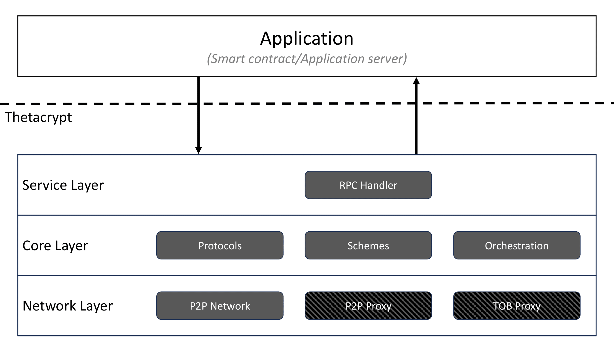

# Thetacrypt - Threshold Cryptography in Rust

Thetacrypt architecture encompasses three layers:

- The **service** layer: Implements the management code for the service and the handlers of the API.
- The **core** layer: Implements the logic, the primitives and the orchestration code to run the threshold cryptographic operations.
- The **network** layer: Implements the modules to exchange peer-to-peer messages between the participating parties.

The cryptographic heart of the Thetacrypt is the **schemes** module. In the contest of the service architecture, the schemes module is part of the core layer, providing the implementation of different threshold cryptographic schemes. This module is self-contained and can be used as a *standalone library* in any Rust project.

One can import the `schemes` module in a Rust application to for example use the primitives required to encrypt data to submit for threshold decryption or verify signatures created using a threshold signature scheme.

Alternatively, one can use Thetacrypt as a library through the **SchemeAPI** and directly access the cryptographic primitives in a more fine-grained manner.
<!-- 
 -->
<!-- Using HTML to enforce size -->
<p align="center">

</p>

## Repo organization

The current directory contains all the code developed for the codebase of Thetacrypt. The modularity is reflected in the `Cargo.toml` file in the root directory. The root package `thetacrypt` provides all the binary necessary to configure, start and execute the service. Then aggregates in the same workspace the packages `service`, `core` (with its inner structure), and `network` to provide an exact mapping to the architecture presented. The directory `proto` contains the specification of the protobuf types used to implement the API of the service with gRPC. The `conf` directory acts as a staging area for configuraton files, created by the binaries for the setup of the service, and used by instances of the servers. 

To learn more about the binaries needed to setup and use the service continue reading on this page. To learn more about the internal structure of the different packages, go to the readmes in specific directories. 

To try immediately Thetacrypt go back to the repo's root folder and checkout the demo in docker. 


## Installation

You can download and install Rust on Linux using 

    curl https://sh.rustup.rs -sSf | sh

To run the schemes test application, use 

    cd src
    cargo run --release

## How to run the server

### Generating server configuration

You can use the `confgen` binary to generate the configuration files that are needed to start server and client instances.
For help, run:
```
cargo run --bin confgen -- --help
```
or, if you have already installed the binary, simply:
```
confgen --help
```

The steps to generate the configuration files are the following, assuming `src\protocols` as cwd, and that one wants a local deployment.

1. Create a file with the IP addresses of the servers. For example you can use:

```
echo "127.0.0.1
127.0.0.1
127.0.0.1
127.0.0.1" > conf/server_ips
```

2. Generate configuration files:

```
cargo run --bin confgen -- --ip-file conf/server_ips.txt --port-strategy consecutive --outdir=conf
```

The option `--port-strategy` can be `static` or `consecutive`. The first uses the same port for each IP (suited for a distributed deployment), and the latter assigns incremental values of the port to the IPs (suited for a local deployment).

The binary `confgen` generates an extra config file, `client.json`, that has a list of the servers' public information: ID, IP, and rpc_port. This information can be used by a client script to call Thetacrypt's services on each node.


3. Generate the keys for each server. 

The codebase of Thetacrypt provides a binary, `ThetaCLI`, to perform complementary tasks. Said binary can be used with the parameter `keygen` to perform the initial setup and key generation and distribution among a set of `N` servers.
It writes the keys for each server in a chosen directory. For a deployment with 4 servers and a threshold of 3, run:
```
cargo run --bin thetacli -- keygen -k=3 -n=4 --subjects Sg02-Bls12381 --output ./conf
```

By default, the newly generated key gets appended to the list of keys in the output file specified through `--dir`. To a completely new file and overwrite the previous key is possible to add the `--new` flag at the end. 
```
cargo run --bin thetacli -- keygen -k=3 -n=4 --subjects Sg02-Bls12381 --output ./conf --new
```

To generate the keys, information on the scheme and group is needed. Available schemes are:

- Bz03 (pairings, DL)
- Sg02 (DL)
- Bls04 (pairings, DL)
- Cks05 (DL)
- Frost (DL)
- Sh00 (RSA)

Available groups are:

- Bls12381 (pairings)
- Bn254     (pairings)
- Ed25519 
- Rsa512 (no DL)
- Rsa1024 (no DL)
- Rsa2048 (no DL)
- Rsa4096 (no DL)

For more information run the binary with `--help` option.

To setup the network of servers with all possible available schemes you can run `thetacli` script with the `--subjects` flag set to "*all*":
```
cargo run --bin thetacli -- keygen -k=3 -n=4 --subjects all --output ./conf --new
```

### Starting the server binary

The server is implemented in `src\bin\server.rs`.
From the root directory of the `protocols` project start 4 terminals and run, respectively:
```
cargo run --bin server -- --config-file conf/server_1.json --key-file conf/node1.keystore
cargo run --bin server -- --config-file conf/server_2.json --key-file conf/node2.keystore
cargo run --bin server -- --config-file conf/server_3.json --key-file conf/node3.keystore
cargo run --bin server -- --config-file conf/server_4.json --key-file conf/node4.keystore
```

Or use the supplied `start_network.sh` script to start four instances in a single terminal.

The server prints info messages, to see them set the following environment variable: `RUST_LOG=info`
(or see here for more possibilities: https://docs.rs/env_logger/latest/env_logger/).

You should see each server process print that it is connected to the others and ready to receive client requests.

**The server can also be run without specifying the `--key-file` flag, this is optional.** In the future, the service will support algorithms to generate the key(DKG) or compute randomness in a distributed manner without any previous setup.

## Run an example client

An RPC client, meant only to be used as an example, can be found in `\src\bin\client.rs`. To run this client, open a new terminal and run:
```
cargo run --bin client -- --config-file=conf/client.json
```
The client presents a menu of options for experimenting with the different schemes provided by the service. For example, in the case of a decryption operation, it creates a ciphertext and then submits a decryption request to each server using the `decrypt()` RPC endpoints.
The code waits for the key **Enter** to be pressed before submitting each request.

## Run the binary ThetaCLI for complementary tasks

There exists a CLI application which can be used to encrypt files and generate keys. Use `cargo run --bin thetacli` to build and run the CLI application. 

We already used this application for **generating the keys**, but it has other two functions. It can be used to **encrypt** a piece of data that later might be decrypted by the servers in the Thetacrypt network, and to **verify** a signature issued by the network. 

Usage: `./thetacli [action] [params]`
available actions:

- `keygen -k [k] -n [n] --subjects [subjects] --output [output_dir]` \
  generates the public/private keys for the specified schemes and groups \
  `-k` = threshold \
  `-n` = number of private keys \
  `--output` = directory to store generated keys in \
  `--subjects` = a list of comma separated elements of the format `'scheme-group'`, where <br> `'scheme'` is one of the following: 
    - encryption schemes: sg02, bz03
    - signature schemes: bls04, frost, sh00
    - coin schemes: cks05 <br>
  and `'group'` is one of \
    'bls12381', 'bn254', 'ed25519', 'rsa512', 'rsa1024', 'rsa2048'. \
  `--new` = overwrite existing files \
  example: `./thetacli keygen 3 5 sg02-bls12381,bz03-ed25519 /path/to/keys/` <br>

- `keystore [action] [keystore_location]` \
    modify / inspect a local keystore file <br>
    the following actions are available: <br>
    `ls` = list keys in a given keystore file \
    `fetch` = fetch public keys from a remote server and store them in a keystore file \
    &emsp; `--address` specifies the remote thetacrypt node to connect to (format `https://ip:port`) \
    `add` = add a local key to the keystore \
    &emsp; `--input` the input key file to add to the keystore (can be private or public) \

- `enc --pubkey [pubkey] --infile [infile] --label [label] --output [output]` \
    encrypt a given infile and store it as outfile \
    `--pubkey` = path to a file containing the public key of a threshold encryption scheme \
    `--keystore` = path to a .keystore file (alternative to providing `pubkey` directly) \
    `--key-id` = id of the public key to use (only needed when using keystore) \
    `--infile` = path to the file to be encrypted (alternatively, `stdin` can be used to provide data to be encrypted) \
    `--label` = label (string) for ciphertext \
    `--output` = path to a file to store the encoded ciphertext in (use - to print to `stdout`)

- `verify --pubkey [pubkey] --msg [msg] --signature [signature]` \
    verify a given signature for a specific message using the specified public key <br>
    `--pubkey` = path to a file containing the public key of a threshold encryption scheme \
    `--keystore` = path to a .keystore file (alternative to providing `pubkey` directly) \
    `--key-id` = id of the public key to use (only needed when using keystore) \
    `--msg` = path to message file (bytes) \
    `--signature` = path to signature to verify (hex encoded)


## About **Tokio** and **async_std**

Both are asynchronous runtimes for Rust that don't seem to differ much from each other. Since **Tokio** has a larger ecosystem than **async_std** we decided to use **Tokio** as asynchronous runtime.

Tokio:
- https://tokio.rs/
- https://tokio.rs/tokio/tutorial

async_std:
- https://crates.io/crates/async_std
- https://book.async.rs/