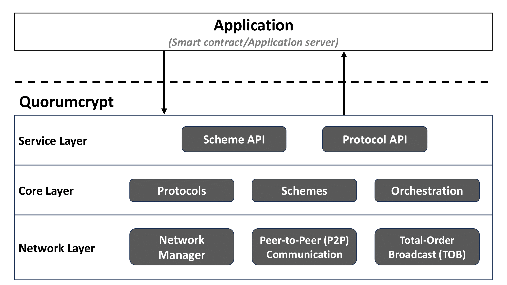

# ThetaCrypt - Threshold Cryptography in Rust

Thetacrypt architecture encompasses three layers:

- The **service** layer: Implements the management code for the service and the handlers of the API.
- The **core** layer: Implements the logic, the primitives and the orchestration code to run the threshold cryptographic operations.
- The **network** layer: Implements the modules to exchange peer-to-peer messages between the participating parties.

The heart of the Thetacrypt lies in the **schemes** module. In the contest of the service architecture, the schemes module is part of the core layer, providing the implementation of different threshold cryptographic schemes. This module is self-contained and can be used as a *standalone library* in any Rust project.

One can import the `schemes` module in a Rust application to for example use the primitives required to encrypt data to submit for threshold decryption or verify signatures created using a threshold signature scheme.

## Repo organization

## Installation

You can download and install Rust on Linux using 

    curl https://sh.rustup.rs -sSf | sh

To run the schemes test application, use 

    cd src
    cargo run --release

//TODO: move the documentation on ThetaCLI

## ThetaCLI
Alternatively, there exists a CLI application which can be used to encrypt files and generate keys. Use `cargo run --bin thetacli` to build and run the CLI application. 
Usage: `./thetacli [action] [params]`
available actions:
- `keygen [k] [n] [algorithms] [directory]` \
  generates the public/private keys for the specified schemes and groups \
  `k` = threshold \
  `n` = number of private keys \
  `directory` = directory to store generated keys in \
  `algorithms` = a list of comma separated elements of the format `'scheme-group'`, where   `'scheme'` is one of the following: 
    - encryption schemes: sg02, bz03
    - signature schemes: bls04, frost, sh00
    - coin schemes: cks05  
   
  and `'group'` is one of \
    'bls12381', 'bn254', 'ed25519', 'rsa512', 'rsa1024', 'rsa2048'. \
  example: `./thetacli keygen 3 5 sg02-bls12381,bz03-ed25519 /path/to/keys/`   
      

- `enc [pubkey] [infile] [label] [outfile]` \
    encrypt a given infile and store it as outfile \
    `pubkey` = public key of a threshold encryption scheme \
    `infile` = path to file to be encrypted \
    `label` = label for ciphertext \
    `outfile` = path to file to store the encoded ciphertext in
- `verify [pubkey] [msg] [signature]` \
    verify a given signature for a specific message using the specified public key  
    `pubkey` = public key of a threshold encryption scheme \
    `msg` = path to message file (bytes) \
    `signature` = path to signature to verify (hex encoded)