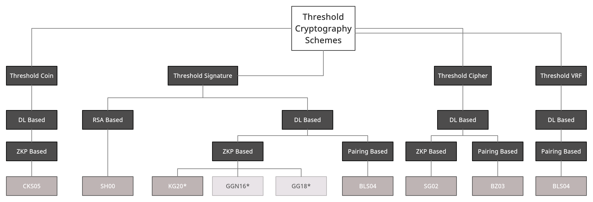

# Schemes layer 
The schemes layer provides the bare cryptographic primitives which will be used in the protocols layer. The schemes layer can also be used in isolation, for example to encrypt data using a specific public key of a threshold cipher, or to verify a threshold signature. 

## Dependencies
This crate uses [Miracl Core](https://github.com/miracl/core) for the underlying elliptic curve implementations and [GMP](https://gmplib.org/) for big integer handling in the RSA signature scheme using the [gmp-mpfr-sys](https://crates.io/crates/gmp-mpfr-sys) Rust FFI bindings. 

## Overview

There are 3 kinds of threshold schemes available: `ThresholdCipher`, `ThresholdSignature` and `ThresholdCoin`. For each of the three categories, the following schemes are implemented:

Threshold Ciphers:
- [Sg02](https://link.springer.com/content/pdf/10.1007/s00145-001-0020-9.pdf) (ZK-based)
- [Bz03](https://citeseerx.ist.psu.edu/viewdoc/download?doi=10.1.1.119.1717&rep=rep1&type=pdf) (Pairing-based)

Threshold Signatures:
- [Bls04](https://link.springer.com/article/10.1007/s00145-004-0314-9) (Pairing-based)
- [KG20/FROST](https://eprint.iacr.org/2020/852.pdf) (ZK-based)
- [Sh00](https://www.iacr.org/archive/eurocrypt2000/1807/18070209-new.pdf) (Threshold RSA)

Threshold Coins:
- [Cks05](https://link.springer.com/content/pdf/10.1007/s00145-005-0318-0.pdf) (ZK-based)

All of those schemes use keys of the type `PublicKey` or `PrivateKey` respectively. The special thing about the `PrivateKey` struct is that there are multiple private keys related to a single public key and they each only represent a share of the actual private key (which should remain inaccessible). Each party will hold a `PrivateKey` object, which contains a `PublicKey` object. Keys can be generated using the `KeyGenerator`, which returns a vector uf private keys. To generate these keys, the concrete scheme and the underlying group need to be specified. For the schemes that are pairing-based, the group needs to support pairings. So far, the following elliptic curves are supported:

- Bls12381 (supports pairings)
- Bn254 (supports pairings)
- Ed25519 (no pairings)
 

## Demo
You can find an example program in the folder `src/examples/main.rs` that shows how the primitives of the schemes layer can be used.

## Key Generation
To generate a vector of private keys, use

    let private_keys = KeyGenerator::generate_keys(
        K, 
        N, 
        &mut RNG::new(RngAlgorithm::MarsagliaZaman), 
        &ThresholdScheme::Sg02, 
        &Group::Bls12381)
        .unwrap();

where 
- `K` = threshold
- `N` = total private keys
- `RNG` = random number generator to be used, here a MarsagliaZaman algorithm is used
- `ThresholdScheme` = the scheme that should be used
- `Group` = the underlying group

Internally, this uses a polynomial of degree `K-1`, i.e., the reconstruction threshold is `K`.
Any `K` in the range `[1, N]` can be used (depending on the tolerated failures of the higher level, the blockchain used for communication, etc.)

**PrivateKey** 
- **`get_scheme(&self) -> ThresholdScheme `** 
- **`get_id(&self) -> u16`**
- **`get_group(&self) -> Group`**
- **`get_threshold(&self) -> u16`**
- **`get_public_key(&self) -> PublicKey`** 

**PublicKey** 
- **`get_scheme(&self) -> ThresholdScheme `**
- **`get_group(&self) -> Group`**
- **`get_threshold(&self) -> u16`** 
- **`get_n(&self) -> PublicKey`** 

Once the keys are generated, the API for all schemes/groups stays the same. One can put the keys into use using the structs below:

## Threshold Cipher
In threshold encryption one participant encrypts a message using the public key. To retrieve the original plaintext from a ciphertext, `K` out of `N` participants holding a private key need to create a decryption share (using `partial_decrypt`) which then are combined resulting in a decrypted ciphertext. Decryption shares as well as the ciphertext should be verified before assembling the shares resp. before creating a decryption share to prevent CCA attacks.

The interface of `ThresholdCipher` is as follows:

**ThresholdCipher** 
- **`encrypt(msg: &[u8], label: &[u8], pubkey: &PublicKey, params: &mut ThresholdCipherParams) -> Result<Ciphertext, ThresholdCryptoError>`**
- **`verify_ciphertext(ct: &Ciphertext, pubkey: &PublicKey) -> Result<bool, ThresholdCryptoError>`**
- **`verify_share(share: &DecryptionShare, ct: &Ciphertext, pubkey: &PublicKey) -> Result<bool, ThresholdCryptoError>`**
- **`partial_decrypt(ct: &Ciphertext, privkey: &PrivateKey, params: &mut ThresholdCipherParams) -> Result<DecryptionShare, ThresholdCryptoError>`**
- **`assemble(shares: &Vec<DecryptionShare>, ct: &Ciphertext) -> Result<Vec<u8>, ThresholdCryptoError>`** 

**ThresholdCipherParams** 
- **`new() -> Self`**
- **`set_rng(&mut self, alg: RngAlgorithm) -> Self`**

## Threshold Signature
`K` out of `N` participants partially sign a message and those partial signatures are then assembled to a single full signature which can be verified alone without knowing the partial signatures. The signature shares should be verified before assembling to prevent attacks.

The interface of `ThresholdSignature` is as follows:

**ThresholdSignature** 
- **`partial_sign(msg: &[u8], label: &[u8], secret: &PrivateKey, params: &mut ThresholdSignatureParams) -> Result<SignatureShare, ThresholdCryptoError> `**
- **`verify_share(share: &SignatureShare, msg: &[u8], pubkey: &PublicKey) -> Result<bool, ThresholdCryptoError> `**
- **`assemble(shares: &Vec<SignatureShare>, msg: &[u8], pubkey: &PublicKey) -> Result<Signature, ThresholdCryptoError> `**
- **`verify(sig: &Signature, pubkey: &PublicKey, msg: &[u8]) -> Result<bool, ThresholdCryptoError>`** 

**ThresholdSignatureParams** 
- **`new() -> Self`**
- **`set_rng(&mut self, alg: RngAlgorithm) -> Self`**

Additionally the library supports threshold signature schemes that need interaction between the different parties. For such schemes, an `InteractiveThresholdSignature` instance is needed:

**InteractiveThresholdSignature** 
- **`new(key: &PrivateKey, msg: &[u8], label: &[u8]) -> Result<Self, ThresholdCryptoError>`** 
- **`do_round(&mut self) -> Result<RoundResult, ThresholdCryptoError> `**
- **`update(&mut self, round_result: &RoundResult) -> Result<(), ThresholdCryptoError> `**
- **`has_next_round(&self) -> bool `**
- **`is_ready_for_next_round(&self) -> bool `**
- **`get_signature(&self) -> Result<Signature, ThresholdCryptoError>`** 
- **`get_label(&self) -> Vec<u8>`**

## Threshold Coin
Threshold Coin schemes are used to collaboratively generate randomness (one random bit). Each random coin has a name that all participants need to know. `K` out of `N` participants create coin shares using the name of the coin and those shares can then be verified and assembled to retrieve the random coin.

The interface of `ThresholdCoin` is as follows:

**ThresholdCoin** 
- **`create_share(name: &[u8], private_key: &PrivateKey, rng: &mut RNG) -> Result<CoinShare, ThresholdCryptoError> `**
- **`verify_share(share: &CoinShare, name: &[u8],  public_key: &PublicKey) -> Result<bool, ThresholdCryptoError> `**
- **`assemble(shares: &Vec<CoinShare>) -> Result<u8, ThresholdCryptoError> `**

## Serialization
The keys, decryption/signature/coin shares and signatures all implement the `Serializable` trait which implements methods for converting to/from a byte stream: 

    pub trait Serializable:
        Sized
        + Clone
        + PartialEq {
        fn serialize(&self) -> Result<Vec<u8>, ThresholdCryptoError>;
        fn deserialize(bytes: &Vec<u8>) -> Result<Self, ThresholdCryptoError>;
    }

## Error handling
If something fails in one of the methods described above, a `ThresholdCryptoError` is returned, indicating what went wrong:

    pub enum ThresholdCryptoError {
        WrongGroup,
        WrongScheme,
        WrongKeyProvided,
        SerializationFailed,
        DeserializationFailed,
        CurveDoesNotSupportPairings,
        ParamsNotSet,
        IdNotFound,
        IncompatibleGroup,
        WrongState,
        PreviousRoundNotExecuted,
        InvalidRound,
        InvalidShare,
        ProtocolNotFinished,
        NotReadyForNextRound,
        MessageNotSpecified,
        MessageAlreadySpecified,
        SerializationError(String),
        UnknownScheme,
        UnknownGroupString,
        UnknownGroup,
        IOError,
        InvalidParams,
    }

## Big Integers / Groups
When implementing schemes, one should always use the `BigImpl`, `RsaBigInt` and `GroupElement` structs, as they allow for the necessary abstraction between the implementation and the concrete groups that can be used for a particular scheme. The underlying elliptic curve library "Miracl Core" uses different big integer implementations for each curve (as they all have a fixed maximum size depending on the curve modulus), which is why one needs to use the `BigImpl` wrapper to implement schemes in a curve-agnostic way. For the RSA schemes, a different underlying big integer representation was used to allow for more flexibility in modulus size. Therefore, use `RsaBigInt` if you just need a flexible big integer representation and do not operate on an elliptic curve (as is the case for RSA).

The `Group` struct holds information about a certain group, while `GroupElement` are the objects used in a scheme and which should be used for computation.